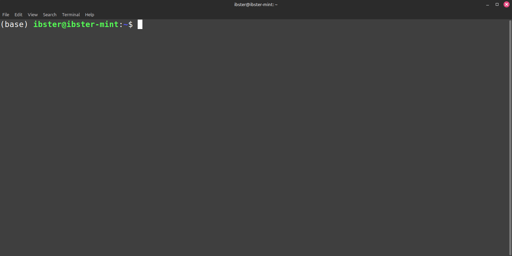
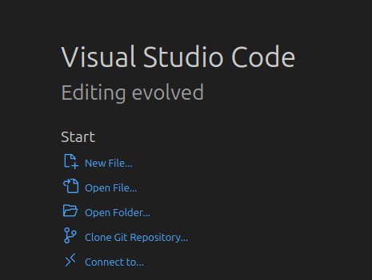
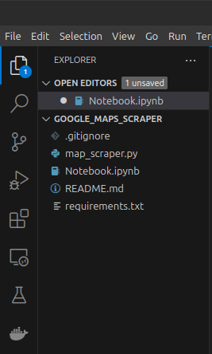

# Google Maps Merchant Scraper

## Installation

To run the program, python, firefox and selenium will need to be installed.

### Python

Install from https://www.python.org/downloads/release/python-3127/. Make sure `pip` is installed alongside python.

### Firefox

This scraper uses the Gecko driver for selenium, which interacts with the firefox driver. Install firefox here https://www.mozilla.org/en-GB/firefox/new/.

### Selenium and Gecko

To install Selenium, run

```
pip install -r requirements.txt
```

from a terminal running within the repositories directory.

Further to this, the selenium gecko driver needs to be installed. The gecko driver can be found at https://github.com/mozilla/geckodriver/releases. Then place it at any location under `$PATH`. To see a list of valid locations, run:

```
echo $PATH
```

### Jupyter Notebooks

If you wish to use the notebook to operate the scraper, you'll need a way to use jupyter notebooks. The easiest way is through VSCode, which can be found here: https://code.visualstudio.com/.

## Usage

### Terminal method

Open a terminal window (Command + Spacebar and search terminal if on macOS), and navigate to the folder the repository is stored in, for example, if the scraper was stored in the `Downloads` folder, run:


```
cd Downloads/google_maps_scraper-main
```

To operate the scraper, run:

```
python3 main.py
```

then follow the onscreen prompts.



### Jupyter Notebooks Method

Launch VSCode and open the folder containing the repository:



Then select `Notebook.ipynb` from the left panel (press `CTRL+B` if it doesn't show).



Then follow the instructions in the notebook to use the scraper. 
